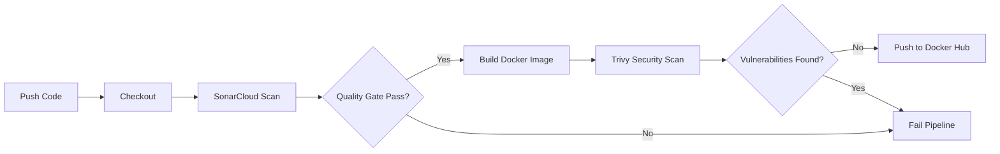

# 🚀 FastAPI DevSecOps Pipeline


## 📋 Sobre o Projeto

Este repositório é um **template robusto para microsserviços em Python**, focado em padronização de ambiente, qualidade de código e segurança.

O projeto vai além de uma simples API, implementando uma esteira completa de **CI/CD (DevSecOps)** que garante:
1.  **Ambiente Reprodutível:** Uso de Poetry e Pyenv para garantir que todos os desenvolvedores usem as mesmas versões e dependências.
2.  **Qualidade de Código:** Análise estática automática via **SonarCloud** (Clean Code).
3.  **Segurança de Containers:** Varredura de vulnerabilidades (CVEs) na imagem Docker utilizando **Trivy**.
4.  **Entrega Contínua:** Build e Push automático para o Docker Hub.

---

## ⚙️ Arquitetura da Pipeline (CI/CD)

O workflow do GitHub Actions (`.github/workflows/ci-cd-pipeline.yml`) executa os seguintes passos a cada *push* na branch `main`:



## 🛠️ Ferramentas da Esteira

* **SonarCloud:** Verifica bugs, code smells e cobertura de código.
* **Docker Buildx:** Criação da imagem otimizada.
* **Trivy:** Scanner de segurança para contêineres e filesystem.
* **Docker Hub:** Registro público das imagens versionadas.

## 🛠️ Tech Stack

* **Linguagem:** Python 3.12+
* **Framework:** FastAPI + Uvicorn
* **Gerenciamento de Dependências:** Poetry
* **Gerenciamento de Versão:** Pyenv / Pipx
* **Containerização:** Docker
* **CI/CD:** GitHub Actions

<br>

## 🚀 Como rodar o projeto localmente

### Instalando pyenv via PowerShell 
```
Invoke-WebRequest -UseBasicParsing -Uri "https://raw.githubusercontent.com/pyenv-win/pyenv-win/master/pyenv-win/install-pyenv-win.ps1" -OutFile "./install-pyenv-win.ps1"; &"./install-pyenv-win.ps1"
```

* *Reinicie o terminal após a instalação.*

### Instale a versão 3.12.3 do Python
```
pip install pyenv 3.12.3
```

### Instalação do Poetry (Gestão de pacotes)
* *Utilizaremos o pipx para instalar o Poetry em um ambiente isolado:*
```
pip install pipx
pipx install poetry
pipx ensurepath
```

* *Reinicie o terminal novamente para carregar as variáveis de ambiente.*

### Criando um novo projeto

```
poetry new api
cd api
```

* *para usarmos exatamente a versão 3.12 no projeto alteramos o arquivo de configuração do projeto o pyproject.toml na raiz do projeto:*

```
[tool.poetry.dependencies]
python = "3.12.*"
```

### Criando ambiente virtual com poetry e instalando o FastAPI
* *execultar o código dentro da pasta do projeto*
```
poetry install 
poetry add fastapi
```

### Criando o código Python
* *crie o arquivo app.py dento da pasta do projeto*

```
from fastapi import FastAPI

app = FastAPI()

@app.get('/')
def read_root():
    return {'message': 'Hello World!'}
```

### Ativando o ambiente virtual e rodando o servidor Uvicorn

```
poetry shell
install poetry[standard]
fastapi dev api/app.py
```

### O terminal retornara a seguinte mensagem:


### Agora, com o servidor inicializado, podemos usar um cliente para acessar o endereço http://127.0.0.1:8000


## 🔐 Configuração de Secrets (Para Fork)

Para que a pipeline funcione no seu repositório, configure as seguintes Secrets no GitHub:

* `SONAR_TOKEN:` Token do projeto no SonarCloud.
* `USER:` Seu usuário do Docker Hub.
* `PASSWD:` Seu token de acesso (ou senha) do Docker Hub.

### Desenvolvido por [Wellygnton Matos](https://www.linkedin.com/in/wellygnton-matos-996322257)
